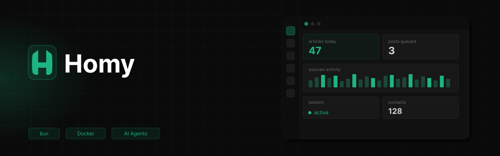

<p align="center">
  
</p>

<p align="center">
  
  
  
  
  
  
</p>

<p align="center">
  <a href="../../README.md">English</a> &nbsp;·&nbsp;
  <a href="./README.fr.md">Français</a>
</p>

---

**Homy** est une plateforme self-hostable conçue pour tourner sur des machines légères comme le Raspberry Pi 5. Elle permet de créer, orchestrer et gérer des agents IA spécialisés ainsi que leurs outils, afin d'automatiser toute sorte de tâches depuis diverses plateformes comme Discord.

## Fonctionnalités

- **Gestionnaire d'agents** · Créez des agents spécialisés, attribuez-leur des capacités, des outils et définissez leurs interactions avec d'autres agents.
- **Gestionnaire d'outils** · Mettez à disposition des agents des outils prêts à l'emploi (recherche web, navigation, appels HTTP, ...) ou importez-en depuis npm.
- **Gestionnaire de skills** · Donnez aux agents des compétences métier précises via des instructions markdown chargées à la demande.
- **Gestionnaire de mémoire** · Les agents apprennent de leurs erreurs, retiennent les bonnes pratiques et s'adaptent au profil de chaque utilisateur.
- **Orchestration d'agents** · Définissez des workflows multi-agents, des pipelines de tâches et des automatisations planifiées via des crons.
- **Interface Discord** · Interagissez avec vos agents directement depuis Discord, par channel ou par mention.

## Architecture
```
homy/
├── packages/
│   ├── api/                        # Backend — Bun + Hono + Drizzle
│   │   └── src/
│   │       ├── handlers/
│   │       │   ├── agents/         # CRUD et exécution des agents
│   │       │   ├── tools/          # Gestion des outils
│   │       │   ├── memory/         # Apprentissage et profils utilisateur
│   │       │   └── crons/          # Tâches planifiées
│   │       └── libs/
│   │           └── database/       # Schéma et migrations Drizzle
│   │
│   ├── web/                        # Frontend — Vite + SolidJS + UnoCSS
│   │   └── src/
│   │       ├── pages/              # Agents, outils, crons, logs
│   │       └── components/
│   │
│   └── discord/                    # Bot Discord — discord.js
│       └── src/
│           ├── handlers/           # Routing messages et streaming
│           └── commands/           # Slash commands
│
├── biome.json
├── bunfig.toml
├── tsconfig.json
└── package.json
```
## Prérequis

- [Bun](https://bun.sh) >= 1.x
- [Docker](https://www.docker.com) (optionnel, pour le déploiement)

## Installation

```bash
git clone https://github.com/yourname/homy
cd homy
bun install
```

## Développement

```bash
bun dev          # Lance tous les packages en parallèle
bun dev:api      # Backend uniquement
bun dev:web      # Frontend uniquement
bun dev:discord  # Bot Discord uniquement
```

## Licence

MIT — voir [LICENSE](../../LICENSE)